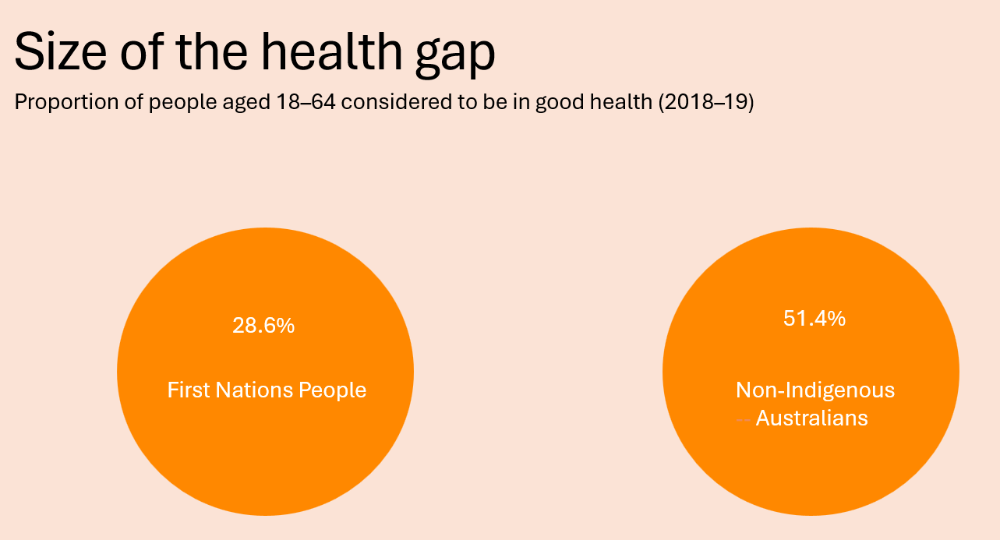
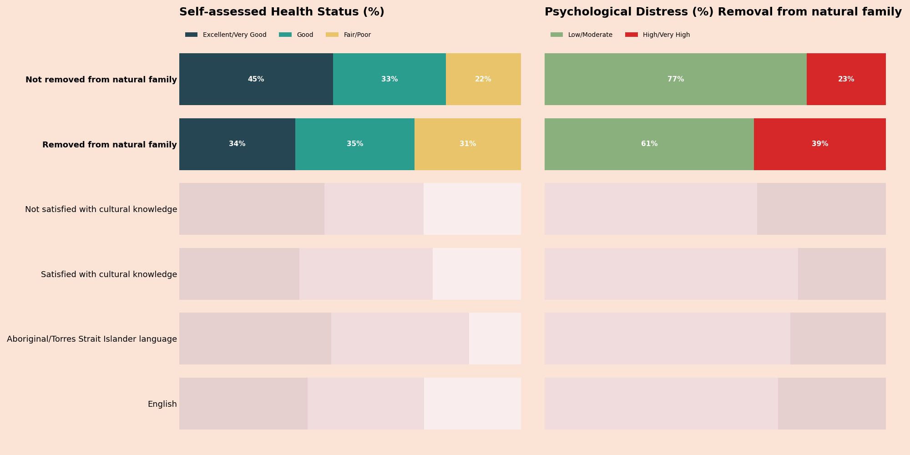
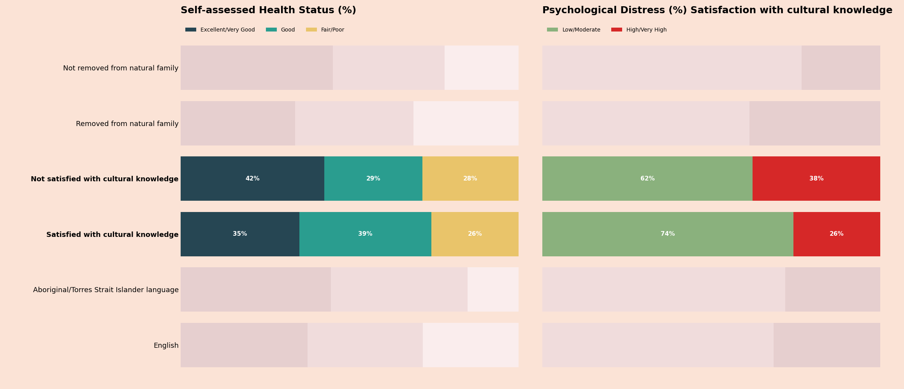
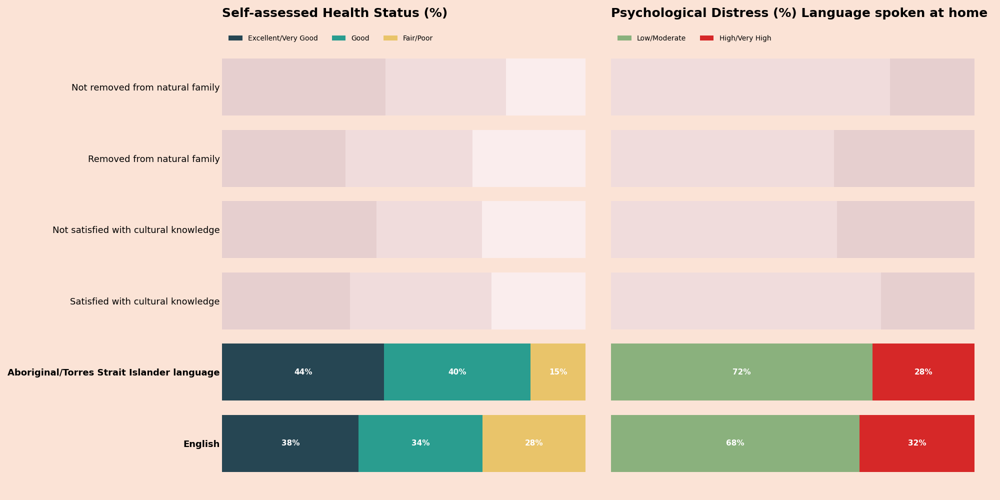

# Culture and Wellbeing: Cultural Determinants of Aboriginal Health

## Overview

This project explores how **cultural factors such as language, cultural knowledge, and connection to family** are associated with health outcomes among **Aboriginal and Torres Strait Islander peoples**.

Using data from the **Australian Bureau of Statistics National Aboriginal and Torres Strait Islander Health Survey**, the analysis applies **storytelling with data principles** to visualise relationships between cultural determinants and wellbeing indicators.

The goal is to highlight how **cultural connection relates to health outcomes**, using clear visualisations to communicate patterns in the data.

---

# The Health Gap

Aboriginal and Torres Strait Islander peoples experience significantly poorer health outcomes compared with non‑Indigenous Australians.

Indicators show differences in:

- Self‑reported health status
- Psychological distress
- Life expectancy

These disparities affect labour force participation, wellbeing, and broader social outcomes.

### Figure 1 — Size of the Health Gap



---

# Cultural Determinants of Health

Cultural identity, language, and connection to family and community are recognised as important determinants of Indigenous wellbeing.

These factors contribute to:

- identity and belonging  
- resilience  
- community connection  
- psychological wellbeing  

Understanding these relationships helps support **evidence‑based policy and health initiatives**.

---

# Data Source

**Dataset:**  
Australian Bureau of Statistics  
*National Aboriginal and Torres Strait Islander Health Survey (2022–23)*

The dataset contains indicators related to:

- self‑assessed health
- psychological distress
- language spoken at home
- satisfaction with cultural knowledge
- family removal history

---

# Visual Analysis

The analysis visualises relationships between cultural determinants and health outcomes using **stacked percentage bar charts**.

Charts compare:

1. Removal from natural family
2. Satisfaction with cultural knowledge
3. Language spoken at home

Colours are used strategically to highlight key comparisons following **Storytelling with Data design principles**.

---

## Removal from Natural Family

### Figure 2 — Health Outcomes by Family Removal



This comparison highlights differences in health outcomes between people who were **removed from their natural family** and those who were **not removed**.

---

## Cultural Knowledge Satisfaction

### Figure 3 — Health Outcomes by Cultural Knowledge



This visualisation examines how **satisfaction with cultural knowledge** relates to self‑assessed health and psychological distress.

---

## Language Spoken at Home

### Figure 4 — Health Outcomes by Language Spoken at Home



This comparison explores differences between individuals who speak **English** at home and those who speak **Aboriginal or Torres Strait Islander languages**.

---

# Key Insights

Across the visualisations, cultural determinants show meaningful associations with wellbeing outcomes.

Patterns suggest that **stronger cultural connection is associated with improved health indicators**, including:

- higher self‑assessed health
- lower psychological distress

These findings align with national research recognising **culture as an important determinant of Indigenous health**.

---

# Technology

Python was used for data analysis and visualisation.

Libraries used:

- **pandas** – data manipulation  
- **matplotlib** – visualisation  
- **matplotlib.patches** – custom legend elements  

---


README.md
```
